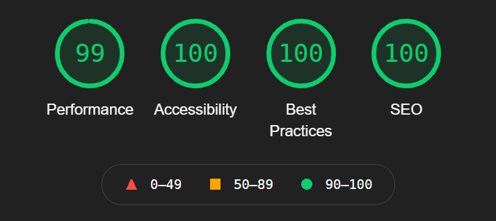

Ta-da, here's my new website! I finally reached a point where I was satisfied with the final product. Way too much time was spent working on this site because (a) I wanted to style it in a way that suits me and (b) the entire thing was coded from scratch since I dislike templates.

I built the site using [Gatsby](https://www.gatsbyjs.com/), a static site generator based on the React framework. In other words, it's pretty fast.

<figure>
    
    <figcaption>
        An almost perfect Lighthouse report for the home page!
    </figcaption>
</figure>

This site is also responsive and fits any screen size thanks to Bootstrap's grid system. It made web development for mobile screens simple, plus it took away most of the headaches that stem from annoying conundrums like centering `
` elements.

Some other features worth mentioning:
- Comment system using GitHub issues (utterances)
- Fancy animations/transitions while navigating
- MDX support for blog posts, like this one
- Support for clients without JavaScript
- A11Y friendly
- Dark mode :)

The source code for this site is available on [GitHub](https://github.com/WhiteHoodHacker/whitehoodhacker.net)!

## So, what's next?

Most of the content on here will be related to security, which may also include writeups for future events. If I have the time, I hope to write posts on a biweekly/monthly basis. I'm working on a few right now that I know a lot of people will enjoy!

Make sure to follow me on [Twitter](https://twitter.com/WhiteHoodHacker) since I'll be sure to announce new posts on my timeline. Additionally, you can add my [RSS feed](https://whitehoodhacker.net/rss.xml) to your favorite reader app. Thanks for stopping by!